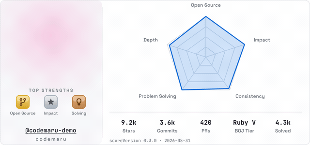
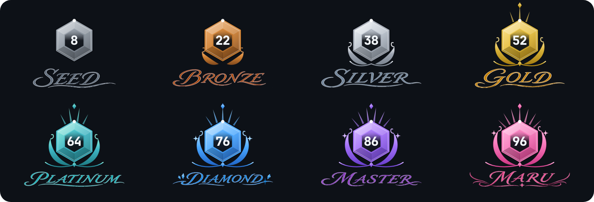
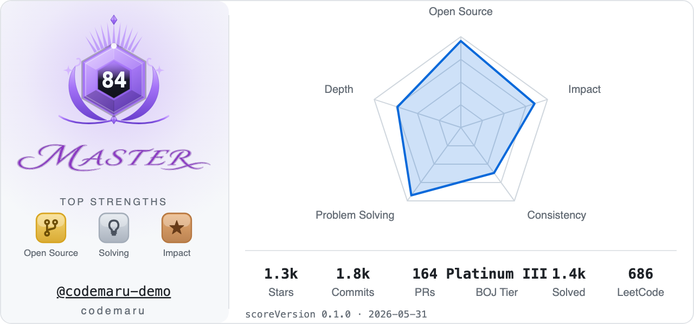
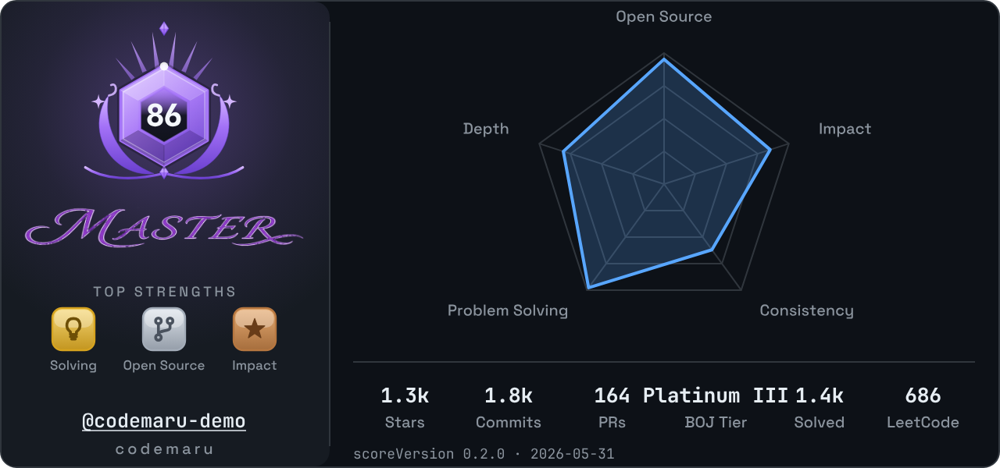
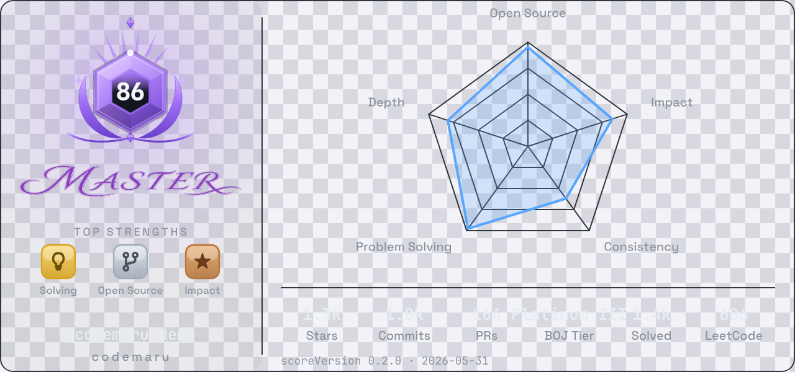
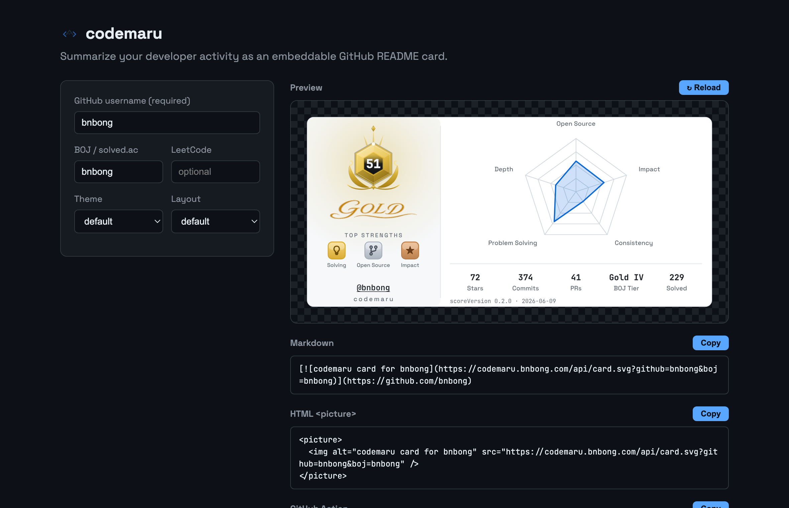

<p align="center">
  
</p>
<p align="center">
<em><b>Codemaru:</b> 개발자의 공개 활동과 알고리즘 학습 기록을 GitHub 프로필 README에 넣을 수 있는 <b>요약 카드</b>로 렌더링하는 도구</em>
</p>
<p align="center">


<a href="https://codecov.io/gh/bnbong/codemaru" >
 
 </a>
<a href="https://codemaru.bnbong.com">
 
 </a>
</p>
<p align="center">
  <a href="README.en.md">English</a> · <b>한국어</b>
</p>

---

> `code` + 순우리말 `마루` — 코딩 실력의 마루에 오르기 위해 계속 성장하세요.

공개된 개발 활동을 README에 넣을 수 있는 SVG 카드로 만들어 주는 도구입니다.

**GitHub**, **백준 / solved.ac**, **LeetCode** 데이터를 읽어 다섯 개 축으로 점수를 매기고, 8단계 티어로 분류, 카드로 렌더링해 README에 바로 붙일 수 있습니다.

<p align="center">
  <picture>
    <source media="(prefers-color-scheme: dark)" srcset=".github/preview/card-dark.gif">
    
  </picture>
</p>

## 티어

Seed부터 시작해서 최고 정상 **Maru**까지:

<p align="center">
  
</p>

```
Seed → Bronze → Silver → Gold → Platinum → Diamond → Master → Maru
```

## 테마

세 가지 테마를 지원합니다. `theme` 파라미터(또는 생성기의 Theme 선택)로 고릅니다.

<table>
  <tr>
    <td align="center"><code>default</code></td>
    <td align="center"><code>dark</code></td>
    <td align="center"><code>transparent</code></td>
  </tr>
  <tr>
    <td></td>
    <td></td>
    <td></td>
  </tr>
</table>

> 더 많은 테마 추후 추가 예정.

`compact=true`(또는 생성기의 Layout → compact)로 켤 수 있는 **compact** 레이아웃 모습은 다음과 같습니다:

<p align="center">
  
</p>

## 빠른 시작

### 사이트 생성기 사용

배포된 사이트 **[codemaru.bnbong.com](https://codemaru.bnbong.com)** 에서 핸들을 입력하면, 실시간 미리보기와 함께 README에 붙여넣을 Markdown / HTML 스니펫을 만들 수 있습니다.

<p align="center">
  
</p>

1. **GitHub username**(필수)과 선택적으로 **BOJ / solved.ac**, **LeetCode** 핸들을 입력합니다.
2. **Theme**(default / dark / transparent)과 **Layout**(default / compact)을 고릅니다.
3. **Preview**에서 카드를 확인하고, **Markdown** 또는 **HTML `<picture>`** 스니펫의 **Copy**를 눌러 README에 붙여넣습니다.
4. 데이터를 새로 불러오려면 **↻ Reload**를 누릅니다.

### 로컬에서 실행

```bash
uv sync                          # 의존성을 .venv에 설치
uv run uvicorn codemaru.app:app --reload   # http://localhost:8000
```

`http://localhost:8000`을 열어 생성기(실시간 미리보기 + 스니펫 복사)를 사용하거나 API를 직접 호출할 수도 있습니다.

> API 엔드포인트와 fixture / live 모드 등 실행·기여에 대한 자세한 내용은 [CONTRIBUTING.md](CONTRIBUTING.md)를 참고하세요.

## GitHub Action으로 직접 호스팅

**`bnbong/codemaru`** Action으로 codemaru 점수/렌더링 파이프라인을 여러분의 repo CI 안에서 직접 실행해 SVG를 커밋하고, 본인의 저장소에서 바로 로드할 수 있습니다.

예시 — 아래 워크플로우를 `.github/workflows/`에 추가하세요:

```yaml
name: Update codemaru card
on:
  schedule:
    - cron: "0 3 * * *"   # 매일 03:00 UTC
  workflow_dispatch:
jobs:
  update:
    runs-on: ubuntu-latest
    permissions:
      contents: write
    steps:
      - uses: actions/checkout@v4
      - uses: bnbong/codemaru@v1
        with:
          github: ${{ github.repository_owner }}   # 본인 GitHub 사용자명 (Action 실행 시 자동으로 치환)
          boj: your-solvedac-handle                # 선택
          leetcode: your-leetcode-handle           # 선택
          out: profile/codemaru.svg
      - run: |
          git config user.name "github-actions"
          git config user.email "github-actions@users.noreply.github.com"
          git add profile/codemaru.svg
          git commit -m "Update codemaru card" || exit 0
          git push
```

그런 다음 커밋된 파일을 README.md의 원하는 위치에 임베드하세요: ``.

| 입력           | 기본값                  | 설명                                                          |
| -------------- | ---------------------- | ------------------------------------------------------------ |
| `github`       | —  (필수)              | 요약할 **GitHub 사용자명**(예: `octocat`)                     |
| `boj`          | `""`                   | solved.ac / 백준 핸들                                         |
| `leetcode`     | `""`                   | LeetCode 핸들                                                 |
| `theme`        | `default`              | `default` \| `dark` \| `transparent`                          |
| `compact`      | `false`                | compact(티어 패널만) 레이아웃                                 |
| `animate`      | `true`                 | 등장 애니메이션 포함 (`false`면 정적 카드)                    |
| `out`          | `profile/codemaru.svg` | SVG 출력 경로                                                 |
| `github-token` | `${{ github.token }}`  | 데이터 조회용 인증 토큰 (**Optional**, 직접 명시할 필요X)        |

> **`github`와 `github-token`은 다릅니다.** `github`에는 토큰이 아닌 **GitHub 사용자명(닉네임)** 을 넣어야 합니다.  
> 
> 예시의 `${{ github.repository_owner }}`는 워크플로우가 실행되는 저장소 소유자의 사용자명으로 자동 치환되는 GitHub 내장 변수이므로 예시 처럼 작성하셨으면 따로 수정할 필요가 없습니다.
>   
> 반면 `github-token`은 **데이터를 읽기 위한 인증 토큰**입니다. **Private Repository**까지 분석에 포함하고 싶다면, private repository read 권한을 가진 PAT를 발급해 저장소 secret(예: `MY_PAT`)에 등록한 뒤 워크플로우에 `github-token: ${{ secrets.MY_PAT }}`로 명시하세요(표 참고).

이 Action은 `codemaru generate --github <user> --out <path>` CLI로도 실행할 수 있습니다.

## 점수 산정 방식

*점수는 **공개 활동**을 요약한 것이지 절대적인 실력 평가가 아닙니다.*

| 축              | 신호 (출처)                                                      |
| --------------- | --------------------------------------------------------------- |
| Open Source     | 커밋, PR, 리뷰, 기여한 repo, 이슈 (GitHub)                       |
| Impact          | 스타, 포크, 팔로워, 공개 repo (GitHub)                          |
| Consistency     | 활동한 날, 최장 연속 기록 (GitHub)                              |
| Problem Solving | 푼 문제 수 (solved.ac + LeetCode)                               |
| Depth           | 알고리즘 깊이(BOJ/LeetCode) **또는** 대표 프로젝트(소유 repo 최다 stars/forks), + 언어 다양성 |

```
점수 계산(티어 가운데 표시된 숫자) = 0.30*openSource + 0.20*problemSolving + 0.20*depth + 0.15*consistency + 0.15*impact
```

신뢰도(confidence)는 각 플랫폼의 **검증 가능한 풀이량**(플랫폼 별 계정 존재 여부X)에 비례하며, 출처 신뢰도로 가중됩니다. 그래서 방금 만든 몇 문제짜리 계정을 연결해도 티어가 부풀려지지 않습니다.

신뢰도가 낮으면 티어 상한이 걸립니다. 한 분야가 강한 **단일 출처** 프로필(예: GitHub만)도 **Master**까지 도달할 수 있고, 최고 티어인 **Maru**는 오픈소스와 알고리즘 양쪽 모두 깊은 **멀티플랫폼 오각형** 역량을 갖춘 경우에만 주어집니다.

> 점수 계산 방식의 자세한 설명과 실제 프로필 단계별 예시는 [docs/SCORING.md](docs/SCORING.md)를 참고하세요.
